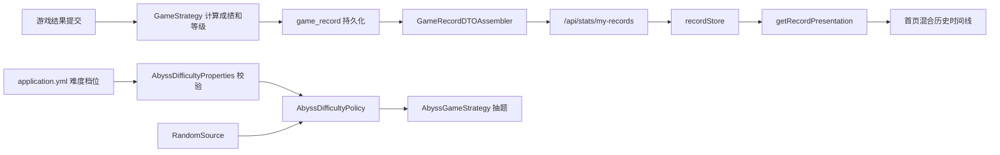

# 游戏记录与深渊难度重构设计

> 状态：设计已确认，待编写实现计划
>
> 日期：2026-07-20

## 1. 背景

当前项目已支持经典模式、专辑闯关和无尽深渊三种玩法，但游戏记录与深渊难度存在三类问题：

1. 游戏记录接口没有返回模式信息，前端无法展示对应的游戏模式。
2. 历史记录统一按普通模式解释分数和等级，导致深渊记录错误显示为“x/10”，并使用普通等级配置。
3. `AbyssDifficultyConfig` 虽能绑定配置，但 `AbyssGameStrategy` 没有使用它，而是在策略内部硬编码区间、概率和 `Math.random()`，因此配置实际不生效，也难以稳定测试。

本次重构不兼容旧数据。项目仍处于开发阶段，可以直接调整表结构、接口结构和前端本地数据结构，并通过重建开发数据库获得一致数据。

## 2. 目标与边界

### 2.1 目标

- 在同一条时间线中混合展示三种模式，并为每条记录增加清晰的模式标签。
- 专辑记录展示具体专辑名，例如“专辑闯关 · 叶惠美”。
- 深渊记录以“连续答对 12 题”作为主成绩，不再按十分制展示。
- 后端成为历史记录的唯一事实来源，前端不再合并本地历史与服务端历史。
- 深渊难度使用可配置、可校验、可注入随机源的独立策略。
- 非法模式或非法配置尽早失败，不使用会掩盖数据问题的默认降级。

### 2.2 边界

- 游客答题结果仍写入后端 `game_record`，继续参与全局统计。
- 游客不拥有“我的历史记录”：前端不保存游客历史，也不请求 `/api/stats/my-records`。
- 排行榜、全局统计口径的进一步拆分不属于本次重构范围。
- 本次不处理旧 `localStorage` 历史和旧数据库记录的迁移。

## 3. 根因分析

### 3.1 模式信息在传输层丢失

`game_record` 表和 `GameRecord` 实体已经包含 `mode`、`albumKey`，但 `GameRecordDTO` 没有暴露这两个字段。数据虽然已落库，但在返回前端时被丢弃。

### 3.2 前端历史模型混淆业务语义与展示语义

`userStore` 当前同时负责本地历史持久化、服务端记录合并、最高分计算和展示数据派生。首页又固定执行普通模式逻辑：

- 成绩统一显示为 `correctCount/10`；
- 等级统一通过普通模式的 `getLevelByScore()` 计算；
- 服务端记录被换算为 `correctCount * 10` 后混入本地数据。

这使深渊模式的“连续答对数”被错误解释为普通十分制分数。

### 3.3 深渊配置没有进入执行链路

`AbyssDifficultyConfig` 仅声明了配置绑定，`AbyssGameStrategy` 没有注入或调用它。实际抽题仍由私有方法中的固定区间、固定概率和 `Math.random()` 决定，因此修改配置不会改变运行结果。

## 4. 总体设计



设计分为两条相互独立的链路：

- 记录链路统一服务端语义模型，再由前端纯函数转换为展示模型。
- 深渊难度链路把配置解析、随机选择和游戏流程分离，避免策略类再次出现硬编码。

## 5. 游戏记录数据模型

### 5.1 模式约束

后端统一使用 `GameMode` 枚举：

- `CLASSIC`：经典模式；
- `ALBUM`：专辑闯关；
- `ABYSS`：无尽深渊。

提交请求中的 `mode` 必填。移除 `null` 时默认 `CLASSIC` 的逻辑，未知值直接返回参数错误。`albumKey` 仅允许在 `ALBUM` 模式出现，并且专辑模式必须提供有效值。

数据库增加以下约束：

```sql
CONSTRAINT chk_game_record_mode
    CHECK (mode IN ('CLASSIC', 'ALBUM', 'ABYSS')),
CONSTRAINT chk_game_record_album
    CHECK (
        (mode = 'ALBUM' AND album_key IS NOT NULL)
        OR
        (mode IN ('CLASSIC', 'ABYSS') AND album_key IS NULL)
    )
```

开发环境不执行旧数据回填，直接使用更新后的 DDL 重建表。

### 5.2 统一的记录响应

`GameResultDTO` 和 `GameRecordDTO` 的公共记录字段保持相同语义，避免提交结果和历史记录出现两套解释：

| 字段 | 类型 | 约束与语义 |
| --- | --- | --- |
| `roundId` | `string` | 必填，单局唯一标识 |
| `mode` | `GameMode` | 必填，不使用字符串兜底 |
| `albumKey` | `string \| null` | 仅 `ALBUM` 模式非空 |
| `score` | `number` | 由对应 `GameStrategy` 计算；普通模式为百分制，深渊为连续答对数 |
| `correctCount` | `number` | 实际答对数；深渊模式下等于最终连续答对数 |
| `totalQuestions` | `number` | 本局实际作答题数 |
| `level` | `string` | 服务端等级枚举名 |
| `levelTitle` | `string` | 服务端等级称号 |
| `timeSpentSecs` | `number` | 本局耗时，单位为秒 |
| `usedRevival` | `boolean` | 是否使用复活；深渊模式固定为 `false` |
| `createdAt` | `string` | ISO 8601 时间字符串 |

`GameResultDTO` 可继续包含 `accuracy`、`levelDescription`、`beatPercentage`、`totalPlayers` 和 `albumResult` 等提交结果专用字段，但公共字段的含义必须与 `GameRecordDTO` 一致。

新增 `GameRecordDTOAssembler`，负责完成以下转换：

1. 严格解析记录的 `GameMode`；
2. 获取对应 `GameStrategy`；
3. 由策略计算 `score` 和等级；
4. 校验 `albumKey` 与模式是否匹配；
5. 构造统一 DTO。

若数据库中出现未知模式或模式与专辑字段不匹配，应抛出数据完整性异常并记录错误日志，不允许降级为经典模式。

### 5.3 游客与登录用户

提交结果时，游客和登录用户都写入 `game_record`：

- 游客记录的 `user_id` 为 `NULL`，参与全局统计，但不会出现在任何用户的个人历史中。
- 登录用户记录写入当前 `user_id`，可由 `/api/stats/my-records` 查询。
- `/api/stats/my-records` 继续要求登录，按 `created_at DESC` 返回最近 20 条记录。

数据库的 `round_id` 唯一约束继续承担重复提交保护。

## 6. 前端历史记录设计

### 6.1 状态职责拆分

新增 `recordStore`，只负责服务端个人历史：

```ts
interface RecordState {
  records: GameRecordDTO[]
  loading: boolean
  error: string | null
}
```

对外提供：

- `fetchMyRecords()`：已登录时加载最近记录；
- `clear()`：退出登录时清空内存记录。

首页进入时：

1. 已登录则调用 `fetchMyRecords()`；
2. 游客不发起历史请求，历史区域不展示；
3. 请求失败展示轻量错误或重试入口，不回退到旧本地历史。

`userStore` 移除以下职责：

- `gameHistory` 本地持久化；
- 服务端与本地历史合并；
- 基于本地记录计算 `bestScore`、`bestLevel`；
- 以日期作为伪唯一键的去重逻辑。

个人记录以服务端 `roundId` 为唯一标识。前端不再把任何模式的游戏记录写入 `localStorage`。

### 6.2 独立展示转换器

新增纯函数 `getRecordPresentation(record)`，将业务 DTO 转换为首页需要的展示结构：

```ts
interface RecordPresentation {
  modeLabel: string
  modeTone: 'classic' | 'album' | 'abyss'
  scoreText: string
  levelTitle: string
  levelColor: string
}
```

转换规则如下：

| 模式 | 模式标签 | 主成绩 | 等级来源 |
| --- | --- | --- | --- |
| `CLASSIC` | 经典模式 | `8/10` | 服务端 `levelTitle` |
| `ALBUM` | 专辑闯关 · 叶惠美 | `8/10` | 服务端 `levelTitle` |
| `ABYSS` | 无尽深渊 | 连续答对 12 题 | 服务端 `levelTitle` |

专辑标签中的展示名通过现有专辑配置按 `albumKey` 查找。有效的 `ALBUM` 记录找不到专辑配置时应明确显示数据错误占位并上报，而不是静默显示“经典模式”。

建议的标签视觉语义：

- 经典模式：金色；
- 专辑闯关：紫色；
- 无尽深渊：红色。

首页模板只消费 `RecordPresentation`，不再直接判断分数区间，也不再调用普通模式的 `getLevelByScore(record.correctCount)`。

## 7. 深渊难度策略

### 7.1 配置模型

将当前固定字段改为档位列表：

```yaml
game:
  abyss:
    difficulty:
      tiers:
        - from: 0
          to: 2
          weights: { EASY: 1.0 }
        - from: 3
          to: 5
          weights: { EASY: 0.3, MEDIUM: 0.7 }
        - from: 6
          to: 9
          weights: { MEDIUM: 0.4, HARD: 0.6 }
        - from: 10
          to: 14
          weights: { MEDIUM: 0.3, HARD: 0.7 }
        - from: 15
          to: 19
          weights: { HARD: 1.0 }
        - from: 20
          to: 29
          weights: { HARD: 0.8, ANY: 0.2 }
        - from: 30
          weights: { HARD: 0.5, ANY: 0.5 }
```

`ANY` 是明确的业务枚举值，表示抽题时不限制难度。只有在最靠近数据访问层的位置才把 `ANY` 转换为“不添加 difficulty 查询条件”，不再用 `null` 表达业务含义。

### 7.2 启动期校验

应用启动时校验完整配置，任一条件不满足则启动失败：

- 至少存在一个档位；
- 第一个档位从 `0` 开始；
- 档位按 `from` 升序排列；
- 区间连续且不重叠；
- 只有最后一个档位允许省略 `to`；
- 每个权重都大于 `0`；
- 每个档位的权重总和为 `1.0`，比较时允许极小浮点误差；
- 权重名称只能是 `EASY`、`MEDIUM`、`HARD`、`ANY`。

校验错误信息需要指出具体档位和原因，便于定位配置问题。

### 7.3 组件职责

`AbyssDifficultyPolicy` 的唯一输入是当前 `streak`，输出为 `DifficultySelection`：

```java
enum DifficultySelection {
    EASY,
    MEDIUM,
    HARD,
    ANY
}
```

其内部流程为：

1. 找到包含当前 `streak` 的档位；
2. 从随机源获取 `[0, 1)` 的值；
3. 按配置顺序计算累计权重；
4. 返回命中的难度选项。

`AbyssGameStrategy` 只负责游戏流程：读取 streak、调用 policy、按 policy 结果抽题、维护 round 缓存。它不再包含区间、概率或随机数实现。

随机能力抽象为 `RandomSource`：

- 生产环境实现使用 `ThreadLocalRandom.current().nextDouble()`；
- 测试实现返回固定序列，以稳定覆盖概率边界。

### 7.4 抽题行为

难度选项与查询条件的映射如下：

| 选项 | 查询行为 |
| --- | --- |
| `EASY` | `difficulty = 'EASY'` |
| `MEDIUM` | `difficulty = 'MEDIUM'` |
| `HARD` | `difficulty = 'HARD'` |
| `ANY` | 不添加难度条件 |

仍需排除本轮已经出现过的题目。如果目标难度没有可用题目，可以回退到 `ANY` 再抽一次；若仍无可用题目，则返回明确的题库不足业务错误。该回退只解决题库容量问题，不改变 policy 的配置结果。

## 8. 错误处理

- 请求缺少 `mode` 或模式非法：返回参数错误。
- `ALBUM` 缺少 `albumKey`，或其他模式携带 `albumKey`：返回参数错误。
- 历史记录含非法模式或不一致专辑字段：按数据完整性错误处理，不伪装成经典记录。
- 深渊配置非法：应用启动失败。
- 深渊目标难度无题：先回退 `ANY`；仍无题时返回题库不足错误。
- 个人历史加载失败：保留空态和重试能力，不读取本地旧历史。

## 9. 测试设计

### 9.1 后端记录测试

- 三种模式提交后均正确持久化 `mode`。
- 只有专辑模式允许并要求 `albumKey`。
- `GameRecordDTO` 返回 `mode`、`albumKey`、`score` 和正确等级。
- 深渊历史的 `score`、`level`、`levelTitle` 由 `AbyssGameStrategy` 计算。
- 未知数据库模式触发数据完整性错误，不降级为普通等级。
- 游客提交仍入库且 `user_id = NULL`；游客记录不会出现在登录用户的个人历史中。
- 相同 `roundId` 重复提交仍被拒绝。

### 9.2 深渊难度测试

- 覆盖 streak 边界：`0`、`2`、`3`、`5`、`6`、`9`、`10`、`14`、`15`、`19`、`20`、`29`、`30`。
- 使用固定随机值验证每个档位的权重分界。
- 验证 `ANY` 不生成 difficulty 条件。
- 验证指定难度无题时回退 `ANY`。
- 验证空档位、起点非零、区间断裂、区间重叠、非法权重和未知名称均导致启动失败。
- 验证 `AbyssGameStrategy` 调用 policy，而不是自行决定难度。

### 9.3 前端测试

- `getRecordPresentation()` 正确转换三种模式。
- 专辑模式正确拼接专辑展示名。
- 深渊主成绩严格显示“连续答对 n 题”，不出现 `/10`。
- 首页按接口顺序混合展示三种模式。
- 游客不调用个人历史接口，也不写入本地历史。
- 登出后 `recordStore` 被清空。
- 接口失败时显示空态或重试入口，不读取旧 `localStorage` 数据。

## 10. 验收标准

1. 登录用户的首页历史在同一时间线中展示经典、专辑和深渊记录。
2. 每条记录均有模式标签；专辑记录包含专辑名。
3. 深渊记录显示“连续答对 n 题”，并展示服务端返回的深渊等级称号。
4. 游客结果继续落库并参与全局统计，但前端不保存或展示游客个人历史。
5. 调整 YAML 中的难度权重后，深渊抽题行为随配置变化。
6. 非法难度配置会阻止应用启动，并给出可定位的错误信息。
7. 后端测试、前端类型检查和生产构建全部通过。

## 11. 实施顺序建议

1. 先用测试锁定统一 DTO、模式约束和深渊 policy 行为。
2. 修改数据库 DDL、请求校验、DTO 与 assembler。
3. 实现并接入 `AbyssDifficultyPolicy`。
4. 新增前端 `recordStore` 和展示转换器，移除 `userStore` 历史职责。
5. 更新首页历史 UI。
6. 运行后端测试、前端类型检查与生产构建，最后进行三种模式的手工验收。
